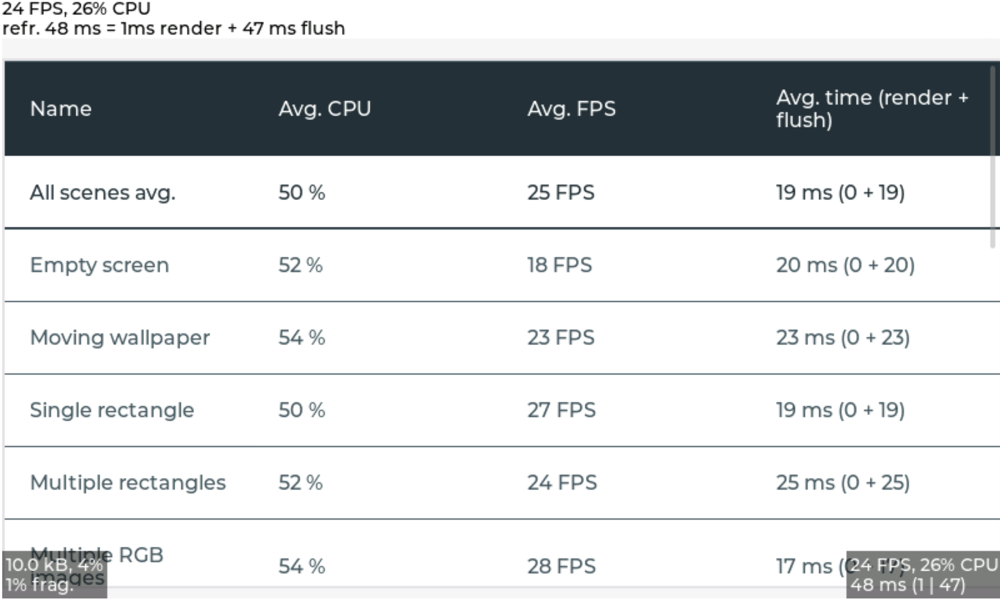

# Benchmark demo

## Overview

The benchmark demo tests the performance in various cases.
For example rectangle, border, shadow, text, image blending, image transformation, blending modes, etc.
All tests are repeated with 50% opacity.

The size and position of the objects during testing are set with a pseudo random number to make the benchmark repeatable.

On to top of the screen the title of the current test step, and the result of the previous step is displayed.

## Run the benchmark
- In `lv_conf.h` or equivalent places set `LV_USE_DEMO_BENCHMARK 1`
- After `lv_init()` and initializing the drivers and call `lv_demo_benchmark(mode)`
- If you only want to run a specific scene for any purpose (e.g. debug, performance optimization etc.), you can call `lv_demo_benchmark_run_scene(mode, scene_idx)` instead of `lv_demo_benchmark()`and pass the scene number.
- If you enabled trace output by setting macro `LV_USE_LOG` to `1` and trace level `LV_LOG_LEVEL` to `LV_LOG_LEVEL_USER` or higher, benchmark results are printed out in `csv` format.

## Modes
The `mode` should be passed to `lv_demo_benchmark(mode)` or `lv_demo_benchmark_run_scene(mode, scene_idx)`.

- `LV_DEMO_BENCHMARK_MODE_RENDER_AND_DRIVER`  Render the scenes and show them on the display. Measure rendering time but it might contain extra time when LVGL waits for the driver. Run each scenes for a few seconds so the performance can be seen by eye too. As only the rendering time is measured and converted to FPS, really high values (e.g. 1000 FPS) are possible.
- `LV_DEMO_BENCHMARK_MODE_REAL` Similar to `RENDER_AND_DRIVER` but instead of measuring the rendering time only measure the real FPS of the system. E.g. even if a scene was rendered in 1 ms, but the screen is redrawn only in every 100 ms, the result will be 10 FPS.
- `LV_DEMO_BENCHMARK_MODE_RENDER_ONLY` Temporarily display the `flush_cb` so the pure rendering time will be measured.  The display is not updated during the benchmark, only at the end when the summary table is shown. Renders a given number of frames from each scene and calculate the FPS from them.

## Result summary
In the end, a table is created to display measured FPS values.

On top of the summary screen, the "Weighted FPS" value is shown.
In this, the result of the more common cases are taken into account with a higher weight.

"Opa. speed" shows the speed of the measurements with opacity compared to full opacity.
E.g. "Opa. speed = 90%" means that rendering with opacity is 10% slower.

In the first section of the table, "Slow but common cases", those cases are displayed which are considered common but were slower than 20 FPS.

Below this in the "All cases section" all the results are shown. The < 10 FPS results are shown with red, the >= 10 but < 20 FPS values are displayed with orange.

**NOTE**:  Compared to the past, the use of rotation and zoom(scaling) in GUI applications has become increasingly common. Therefore, starting from LVGL9, we have assigned a higher priority to zoom(scaling) and rotation operations.
