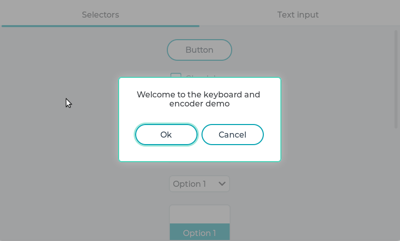

# Keypad and Encoder demo

## Overview

LVGL allows you to control the widgets with keypad and/or encoder without touchpad. 
This demo shows how to handle buttons, drop-down lists, rollers, sliders, switches and text inputs without touchpad. 
Learn more about the touchpad-less usage of LVGL [here](https://docs.lvgl.io/master/overview/indev.html#keypad-and-encoder).

## Run the demo
- In `lv_conf.h` or equivalent places set `LV_USE_DEMO_KEYPAD_AND_ENCODER 1`
- After `lv_init()` and initializing the drivers call `lv_demo_keypad_encoder()`
