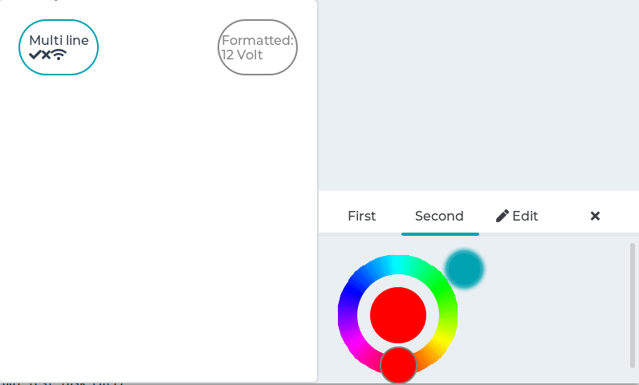

# Stress demo

## Overview

A stress test for LVGL.
It contains a lot of object creation, deletion, animations, styles usage, and so on. It can be used if there is any memory corruption during heavy usage or any memory leaks.

## Run the demo
- In `lv_conf.h` or equivalent places set `LV_USE_DEMO_STRESS 1`
- In `lv_conf.h` enable all the widgets (`LV_USE_BTN 1`) and the animations (`LV_USE_ANIMATION 1`)
- After `lv_init()` and initializing the drivers call `lv_demo_stress()`
