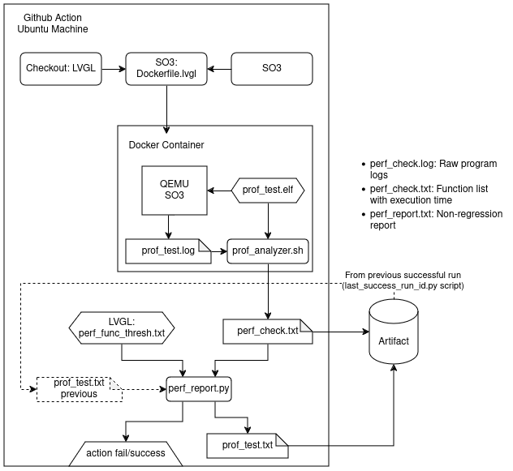

.. _cicd:

============
CICD
============

LVGL uses github actions to perform various operations on the code 

Main Actions
------------

- Micropython build
- C/C++ build
- Documentation build
- PlatformIO publishing
- Release
- Performance test

LVGL Performance Test
---------------------

SO3 is used to check the performance of LVGL. This workflow behaves as shown in this diagram:

	
The actions are described below

#. Retrieve the LVGL commit that triggered the action and store it in a "lvgl_base" folder for the dockerfile to use
#. Retrieve "Dockerfile.lvgl" from the SO3 repository and build the docker image
#. Run the docker image to generate the performance data (function execution times)
#. Store the performance data as an artifact for future reference
#. Find previous successful action run and recover the performance data from it
#. Process the performance data and compare it to previous executions and set thresholds to detect performance issues
#. Create an artifact in the form of a log file that shows the output of the regression test

The image is ran using two volumes: One that redirects the container's "/host" folder to the workflow's working directory and one that allows the container to access the workflow's devices (in the /dev folder) as his own

The workflow is setup to run when
* Commits are pushed to LVGL's repo 
* A pull request is created 
* Launched from another workflow

Dockerfile
^^^^^^^^^^^^^^^^^^^^^^^^^^^^

LVGL's check_perf workflow uses the Dockerfile.lvgl found at the root of this repository to create the image that runs SO3 on qemu and executes the tests. The dockerfile does the following:

#. Creates an Alpine image and installs all the necessary tools (like gcc and qemu)
#. Recovers SO3's main branch in the root ("/") folder 
#. Empties the "*/so3/usr/lib/lvgl*" folder and replaces its content with the LVGL repo to be tested (The LVGL code should be in a "lvgl_base" folder)
#. Patches SO3 so it executes the *prof_test* application instead of the shell at launch
#. Builds U-boot and the SO3 kernel
#. Imports the *prof_test* (*test/perf* folder from LVGL) application into SO3's userspace and builds the userspace
#. Sets up the image so it exposes the port 1234 when ran and executes "./st"

Performance data files
^^^^^^^^^^^^^^^^^^^^^^^

The files used to report on the execution times of the profiled functions and have the same format:

* 1 header line with no defined format (ignored by the script)
* N lines with function data following the "[parent/]<name> [(info)] | <time>" format
	
Parent and info are optionnal (thus marked with []).
Only one time is supported per function-parent pair
Time is expected to be a single value convertible to float. Eventual excess values will be discarded

Functions execution times are always identified by a parent-function pair (in case the function may have different behaviour depending from where it is called).Thresholds can be set for a function or a parent-function pair. parent-function thresholds are used only with exact matches in the performance data file and function thresholds are used as default for any corresponding function that does not have or does not match with a parent (for example a "main/func1" threshold is only used with "main/func1" execution times but "func2" thresholds are used for "main/func2" or "otherFunc/func2" execution times. If only "main/func1" threshold is set, no threshold is considered to be set for "otherFunc/func1" execution times)

Constraints and Guidelines
^^^^^^^^^^^^^^^^^^^^^^^^^^^

LVGL's check_perf workflow relies on GCC's "-finstrument-functions" flag that adds function calls to each function in a file. These function calls are made at the start and end of each function found in a source file when this source file is built with this flag. Both functions can be user-defined. Their current implementation timestamps their execution with the return address of the profiled function. This allows a custom script to analyse the executable file to find the function that was timestamped and calculate its execution time. This approach allows some code to be profiled automatically without the need to explicitely call timestamping functions from within the code

The best way to profile some code is to create a new test application with 2 kinds of files: 
* Setup: Those files define functions that prepare the resources necessary for the execution of the profiled functions. For example, if a profiled function needs to provide a configuration structure to one of its dependencies, the structure can be initialised and configured in it and then passed to the profiling function to be given to the function that requires it. One of those files must implement the functions that will be used by the compiler to instrument the profiled functions (See functions in file *tests/perf/instr_func.c* for prototype). Those files are compiled normally
* Profiling: Those files contain functions whose entry and exit time will be timestamped. Those functions use the functions that you want to profile with the parameters provided by the Setup functions. EVERY function implemented in these files (and ONLY those) will be instrumented and profiled. Those files are compiled using the "-finstrument-functions" flag

Some Quality-of-life recommendations:
* As much as possible, refrain from calling profiled functions inside other profiled functions (or making profiling functions recursive). This decreases reliability in the execution time calculation for the parent function. Instrumentation functions use system calls which are typically quite a bit slower than regular code execution
* The main of the application should be in a Setup file but may also be in a Profiling file if one wants to calculate the overall execution time. Please note however that whatever time is reported also includes the execution time of all the timestamping functions calls of the profiling functions (see recommendation above)

Known Limitations
^^^^^^^^^^^^^^^^^^

* It is required to call the profiling functions (those implemented in the Profiling files) from the main function only as it allows the profiling data analyzer to lookup way less code to find the names of the profiled functions. This can be changed if desired but comes with a massive dip in performance. Analysis may take up to several minutes instead of a few seconds

Improvement ideas
^^^^^^^^^^^^^^^^^^

* Improve instrumentation functions to reduce the need for syscalls (clock_gettime, printf). This could improve the results' reliability
