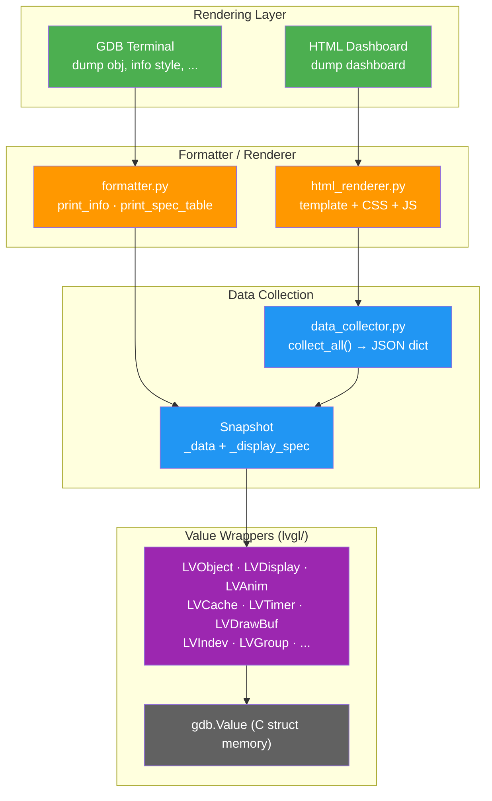
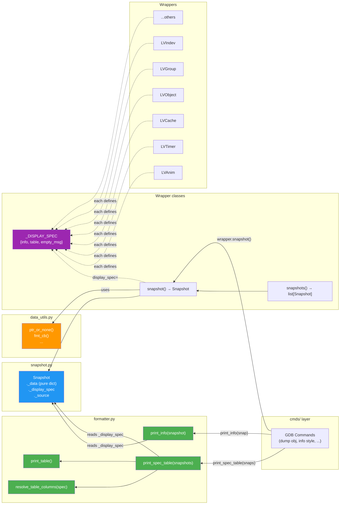

## Debugging LVGL with GDB

To facilitate debugging LVGL with GDB, a GDB plugin is provided. This plugin
can be found in the `lvgl/scripts/gdb` directory. The GDB plugin can be used
with any target where GDB is available. For example, you can use it to debug a
device connected to a PC via JLink, which provides a GDB server. Additionally,
if your device crashes and you have a core dump, you can use GDB to analyze the
core dump. To load the LVGL GDB plugin within GDB's command line, type the
following command:

`source lvgl/scripts/gdb/gdbinit.py`

Example of usage:

```bash
(gdb) source lvgl/scripts/gdb/gdbinit.py

(gdb) dump obj -L 3
Display @0x519000005a80
  Screen @0x507000003eb0 (sys_layer)
    lv_obj @0x507000003eb0  (0,0) 800x480
      lv_label @0x50e000000820  "0 FPS, 0% CPU"  (0,0) 104x32
  Screen @0x507000025da0 (act_scr)
    lv_obj @0x507000025da0  name=main_screen  (0,0) 800x480
      lv_button @0x507000025e80  name=ball_1  (10,60) 40x22  state=FOCUSED
      lv_label @0x50e000037160  "Jump"  (20,11) 36x16
(gdb)
```

The plugin provides the following commands. An argument written as
`<lv_something_t *>` is any C expression GDB can evaluate to that type: a
variable (`my_label`), a member chain (`obj->parent`), the address of a global
(`&lv_button_class`), or a plain address (`0x50e000000820`). A struct variable
and a pointer to it are both accepted, so `info style my_style` and
`info style &my_style` do the same thing.

- `dump obj [-L <depth>] [<widget>]`: Dump the widget tree, from the given
  widget or from every display's screens.
- `dump display [-p <prefix>] [-f bmp|png]`: Export the default display's draw
  buffers to image files.
- `dump cache image|image_header`: Dump image or image header cache entries.
- `check cache image|image_header`: Run a sanity check on that cache.
- `dump anim`: List all active animations.
- `dump timer`: List all active timers.
- `dump indev`: List all input devices.
- `dump group`: List all focus groups with their objects.
- `dump image_decoder`: List all registered image decoders.
- `dump fs_drv`: List all registered filesystem drivers.
- `dump draw_task <lv_layer_t *>`: List the draw tasks of a layer, e.g.
  `dump draw_task lv_global->disp_default->layer_head`.
- `dump dashboard [-o <file>] [--json|--viewer]`: Generate an HTML dashboard of
  all LVGL runtime state.
- `dump widget props [<class>|<widget>]`: List the fields a widget has, by
  class name (`lv_keyboard`) or from a live widget. With no argument, lists the
  widget classes.
- `info widget [<widget>] [<field>...] [-p <path>]`: Inspect one widget, or
  list every widget. The widget can be named instead of addressed. Field names
  limit the output to those fields.
- `info style <lv_style_t>`: Inspect a single style.
- `info style --obj <lv_obj_t *>`: Inspect all styles of a widget.
- `info draw_unit`: Print raw struct details for each drawing unit.
- `info obj_class [--all] [<lv_obj_class_t *>]`: Show a class hierarchy, e.g.
  `info obj_class &lv_button_class` or `info obj_class obj->class_p`. With no
  argument, lists all registered classes.
- `info subject <lv_subject_t *>`: Show a subject and its observers, e.g.
  `info subject my_subject`.
- `info lvgl_version`: Print the LVGL version of the target and the plugin's
  own.
- `lvglobal [-p <pid>]`: (NuttX only) Set which LVGL instance to inspect.

<Callout type="info">
Some versions of `gdb` on Windows (e.g. those delivered with various versions
of Perl) are compiled without Python support, so the `source` command will not
be supported.
</Callout>

## Dump Obj Tree

`dump obj`: Dump the object tree.

`dump obj -L 2`: Dump the object tree with a depth of 2.

`dump obj <widget>`: Dump the tree starting from that widget, named or
addressed - `dump obj main_screen_0`, `dump obj my_screen`,
`dump obj lv_global->disp_default->act_scr`, or `dump obj 0x507000025da0`. See
[Naming a widget](#naming-a-widget).

Each line carries the widget's name, its position and size, any non-default
state, and a summary of what the widget holds - a label's text, an arc's value.
`info widget` prints the very same listing, so it does not matter which of the
two you reach for; to see everything about one of the widgets listed, pass its
name or address to `info widget`.

## Inspect Widget

`info widget`: List every widget of every display, one line each, indented by
tree depth, with screens labelled by the layer they are (`act_scr`,
`top_layer`, …). `-L <n>` limits the depth. This is the same listing `dump obj`
prints.

`info widget <widget>`: Everything known about one widget - geometry, state,
flags, scrolling, event callbacks with their resolved symbol names, and the
fields of its own struct: a label's text and long mode, an arc's angles, a
table's row and column count. This is the data `dump dashboard` shows in the
browser, printed for one widget in the terminal.

`info widget <widget> <field>...`: Print only the named fields. Field names are
the ones the full listing prints, so `text`, `long_mode`, `coords`, `flags`.

`info widget <widget> --tree`: List the subtree below one widget instead of
detailing it.

### Naming a widget

Wherever these commands take a widget, it can be given four ways:

- a **name**: `info widget ball_1`. Names are resolved as
  `lv_obj_get_name_resolved()` resolves them, so a trailing `#` becomes the
  index among the siblings sharing that name, and a widget that was never named
  answers to `<class>_<n>` - `lv_label_0`. The name it was given works too, so
  `main_screen_#` and `main_screen_0` both find the same screen.
- a **name path** from the screen down: `info widget main_screen_0/lv_button_0/label3`.
- a name plus **`-p` / `--parent`**, which is where the search starts:
  `info widget label3 -p screen_1/button_2` looks for `label3` anywhere below
  `screen_1/button_2`.
- a **C expression** GDB can evaluate to an `lv_obj_t *`: a variable
  (`my_label`), a member chain (`lv_global->disp_default->act_scr`), or a plain
  address (`0x50e000000820`).

A bare name is searched across every screen of every display, and every match
is reported rather than the first one:

```text
(gdb) info widget lv_label_0
Error: 'lv_label_0' matches 2 widgets:
  lv_obj_3/lv_label_0  (lv_label @0x50e000000820)
  main_screen_0/lv_button_0/lv_label_0  (lv_label @0x50e000037160)
Narrow it down with --parent, or pass a name path.
```

Example:

```text
(gdb) info widget
Display @0x5555565a2a80
  Screen @0x555556603ba0 (act_scr)
    lv_obj @0x555556603ba0  name=main  (0,0) 800x480
      lv_label @0x555556604820  "Hello world"  (10,10) 104x32
      lv_button @0x555556604910  name=ok_btn  (10,60) 100x40  state=FOCUSED

(gdb) info widget 0x555556604820
lv_label @0x555556604820  "Hello world"
  class          = lv_label -> lv_obj
  parent         = 0x555556603ba0
  coords         = (10,10)-(113,41)  104x32
  children       = 0
  state          = DEFAULT
  flags          = CLICK_FOCUSABLE|SCROLLABLE|SNAPPABLE
  scroll         = (0,0)  dir=ALL  snap=(NONE,NONE)  bar=AUTO
  ext_pad        = click=0  draw=4
  layout         = inv=True  w=False  h=False  layer=NONE
  status         = rendered=True  deleting=False  skip_trans=False
  styles         = 1   (info style --obj 0x555556604820)
  events         = 1
    [0] CLICKED            cb=0x5555555fe7aa <my_click_cb>  user_data=0x0  flags=-
  lv_label
    text           = "Hello world"
    long_mode      = WRAP (0)
    recolor        = False
    ...

(gdb) info widget 0x555556604820 text long_mode
text           = "Hello world"
long_mode      = WRAP (0)
```

## Widget Fields

`dump widget props <class>`: List the fields a widget class has, with their
types and the comment from the LVGL header, grouped by the struct each one
comes from - a keyboard shows its own fields and the button matrix fields it
inherits. It needs no live object, so `dump widget props lv_keyboard` works
before the program is even running.

`dump widget props <widget>`: The same for the class of a live widget, with the
common fields taken from that object rather than from the general list.

With no argument, the widget classes that have fields of their own are listed.

```text
(gdb) dump widget props lv_keyboard
lv_keyboard  (LVKeyboard)
  from lv_keyboard_t
    ta                 pointer  Pointer to the assigned text area
    mode               int      Key map type
    popovers           bool     Show button titles in popovers on press
  from lv_buttonmatrix_t
    map_p              pointer  Pointer to the current map
    btn_cnt            int      Number of button in 'map_p'
    ...
  common (any widget)
    name, class_name, addr, coords, parent, children, styles, state, flags, ...
```

## Inspect Style

`info style <lv_style_t>`: Inspect a single style - `info style my_style` and
`info style &my_style` both work. Properties are
displayed with resolved names and formatted values:

- colors as hex,
- sizes as written in the source, so `LV_PCT(100)` shows as `100%` and
  `LV_SIZE_CONTENT` as `content`,
- enums by name, with bitmasks such as `BORDER_SIDE` combined as `BOTTOM|TOP`,
- pointers as their C symbol, e.g. `TEXT_FONT` as `lv_font_montserrat_16`, or as
  the string an image source points at.

`info style --obj <lv_obj_t *>`: Inspect all styles of a widget, grouped by
style slot with selector and flags.

Example:

```bash
(gdb) info style my_style
+-----------+-----------------------+
| prop      | value                 |
+-----------+-----------------------+
| BG_COLOR  | #ff0000               |
| BG_OPA    | 255                   |
| WIDTH     | 100%                  |
| FLEX_FLOW | COLUMN                |
| TEXT_FONT | lv_font_montserrat_16 |
+-----------+-----------------------+

(gdb) info style --obj lv_global->disp_default->act_scr
[0] MAIN|DEFAULT  local
+-----------+---------+
| prop      | value   |
+-----------+---------+
| BG_COLOR  | #ff0000 |
+-----------+---------+
```

## Connecting to a Debugger

This command provides the ability to connect and debug GDB Python Script using IDE.

Connect to `PyCharm` / `VSCode` / `Eclipse (not supported yet)`

`debugger -t pycharm`

`debugger -t vscode`

`debugger -t eclipse`

Perform a web search for `pydevd_pycharm` or `debugpy` for details about how to
use the debugger.

## Dump Display

`dump display`: Export the current display's draw buffers (buf_1, buf_2) to image files.

```bash
(gdb) dump display
(gdb) dump display -p /tmp/ -f png
```

## Check Cache

`check cache <type>`: Run sanity check on image or image header cache, validating
cross-pointers between red-black tree and linked list, decoded pointers, image sizes,
and source pointers. `<type>` is `image` or `image_header`.

## Dump Animations

`dump anim`: List all active animations in a table with exec_cb, value range,
duration, repeat count, and status.

`dump anim --detail`: Print detailed info for each animation.

## Dump Timers

`dump timer`: List all active timers with callback, period, frequency, last_run,
repeat count, and paused state.

## Dump Input Devices

`dump indev`: List all registered input devices with type, state, read callback,
and configuration (long_press_time, scroll_limit, group).

## Dump Focus Groups

`dump group`: List all focus groups with object count, frozen/editing/wrap state,
and focused object.

## Dump Image Decoders

`dump image_decoder`: List all registered image decoders with name, info_cb,
open_cb, and close_cb.

## Dump Filesystem Drivers

`dump fs_drv`: List all registered filesystem drivers with drive letter, driver type,
cache size, and callbacks (open, read, write, close).

## Dump Draw Tasks

`dump draw_task <lv_layer_t *>`: Walk the draw task linked list of a layer and
display each task's type, state, area, opacity, and preferred draw unit id. A
display's layers start at `lv_global->disp_default->layer_head`.

## Dump Dashboard

`dump dashboard`: Collect all LVGL runtime state (displays, object trees,
animations, timers, caches, input devices, groups, draw units/tasks,
subjects/observers, image decoders, filesystem drivers) and generate a
self-contained HTML file for offline browsing.

The dashboard supports three output modes:

- `dump dashboard`: Generate `lvgl_dashboard.html` with all data embedded.
- `dump dashboard --json`: Export raw JSON data to `lvgl_dashboard.json`.
- `dump dashboard --viewer`: Generate an empty HTML viewer (`lvgl_viewer.html`)
  that can load JSON files via drag-and-drop.

Use `-o <path>` to specify a custom output path.

Example:

```bash
(gdb) dump dashboard
Dashboard written to lvgl_dashboard.html (1.23s)

(gdb) dump dashboard --json -o /tmp/state.json
Dashboard written to /tmp/state.json (0.98s)

(gdb) dump dashboard --viewer
Viewer written to lvgl_viewer.html
```

The generated HTML is fully self-contained (no external dependencies) and
includes a sidebar for navigation, a search box for filtering, collapsible
object trees with style details, framebuffer image previews, and cross-reference
links between related objects.

## Inspect Object Class

`info obj_class <lv_obj_class_t *>`: Show the class hierarchy chain of a class,
e.g. `info obj_class &lv_button_class` or `info obj_class obj->class_p`.

`info obj_class --all`: List all registered object classes in a table.

Example:

```text
(gdb) info obj_class lv_button_class
ObjClass: lv_button -> lv_obj -> lv_obj
  name           = lv_button
  base           = lv_obj
  size           = 48 editable=0 group_def=2
  editable       = 0
  group_def      = 2
  default_size   = (CONTENT, CONTENT) theme_inheritable=True
  theme_in      = True
```

## Inspect Subject

`info subject <lv_subject_t *>`: Show a subject's type and all its observers,
e.g. `info subject my_subject`.

Example:

```text
(gdb) info subject my_subject
Subject: type=INT subscribers=2
  Observer: cb=<my_cb> target=0x... for_obj=True
```

## Inspect LVGL Version

`info lvgl_version`: Print the LVGL version the target was built from, and the
version of the plugin itself.

Example:

```text
(gdb) info lvgl_version
LVGL:    9.6.0-dev
lvglgdb: 0.5.0
```

The version is read from the target rather than from the plugin's own copy of
LVGL, so it is right even when a newer plugin inspects an older application.
Three sources are tried in turn, because none of them is available in every
build:

1. `lv_version_major()` and friends. These are `static inline`, so they only
   reach the binary if something calls them, which usually nothing does.
2. The `LVGL_VERSION_*` macros. These need a `-g3` build *and* a stop inside a
   translation unit that included `lv_version.h`. A breakpoint on
   `lv_timer_handler` does not qualify, so `-g3` alone is not enough.
3. `lv_version.h` on disk, located through the DWARF source path of any LVGL
   symbol. This is the one that usually answers, and it works whenever the
   sources are still where the compiler found them.

If a field cannot be read it prints as `?`, and if none of the three works the
command says so instead of guessing. Building with `-g3` and keeping the LVGL
sources in place is enough to get a full answer.

## Set LVGL Instance (NuttX)

`lvglobal`: Set which LVGL instance to inspect by finding the `lv_global`
pointer. On single-instance systems, it auto-detects the global. On NuttX
multi-process systems, use `--pid` to specify the target process.

```bash
(gdb) lvglobal
(gdb) lvglobal --pid 3
```

## Data Export API

Each wrapper class provides a `snapshot()` method that returns a `Snapshot
object containing a pure Python dict (JSON-serializable) plus an optional
reference to the original wrapper via source`.

```python
from lvglgdb import LVTimer, curr_inst

timers = list(curr_inst().timers())
snap = timers[0].snapshot()

# Dict-like access
print(snap["timer_cb"], snap["period"])

# JSON serialization
import json
print(json.dumps(snap.as_dict(), indent=2))

# Bulk export
snapshots = LVTimer.snapshots(timers)
data = [s.as_dict() for s in snapshots]
```

The `Snapshot` class supports dict-like read access (`[]`, `keys()`,
`len()`, `in`, iteration) and `as_dict()` for JSON serialization.
All values in `as_dict()` are pure Python types (`str`, `int`, `float`,
`bool`, `None`, `dict`, `list`) with no `gdb.Value` references.

Wrapper classes with `snapshot()` support: `LVAnim`, `LVTimer`,
`LVIndev`, `LVGroup`, `LVObject`, `LVObjClass`, `LVObserver`,
`LVSubject`, `LVDrawTask`, `LVDrawUnit`, `LVFsDrv`,
`LVImageDecoder`, `LVCache`, `LVDisplay`,
`LVRedBlackTree`, `LVEventDsc`, `LVList`.

`LVStyle` provides `snapshots()` (plural) which returns a list of
`Snapshot` objects for each style property, but does not have a singular
`snapshot()` method.

Most wrapper classes also provide a static `snapshots(items)` method for
bulk export (e.g. `LVAnim.snapshots(anims)`). Additionally,
`LVImageCache` and `LVImageHeaderCache` provide instance-level
`snapshots()` methods that export all cache entries.

## Architecture

The GDB plugin is organized into four layers. The overview below shows how
terminal commands and the HTML dashboard both flow through the same snapshot
abstraction down to raw GDB memory access:



Each wrapper class declares a `_DISPLAY_SPEC` describing its fields and
exports a `snapshot()` method that returns a self-describing `Snapshot`
object carrying both the data dict and the display spec. The `cmds/` layer
simply passes snapshots to generic formatters (`print_info`,
`print_spec_table`) which read the embedded spec to render output — no
command needs to know the internal structure of any wrapper. The detailed
snapshot flow is shown below:


