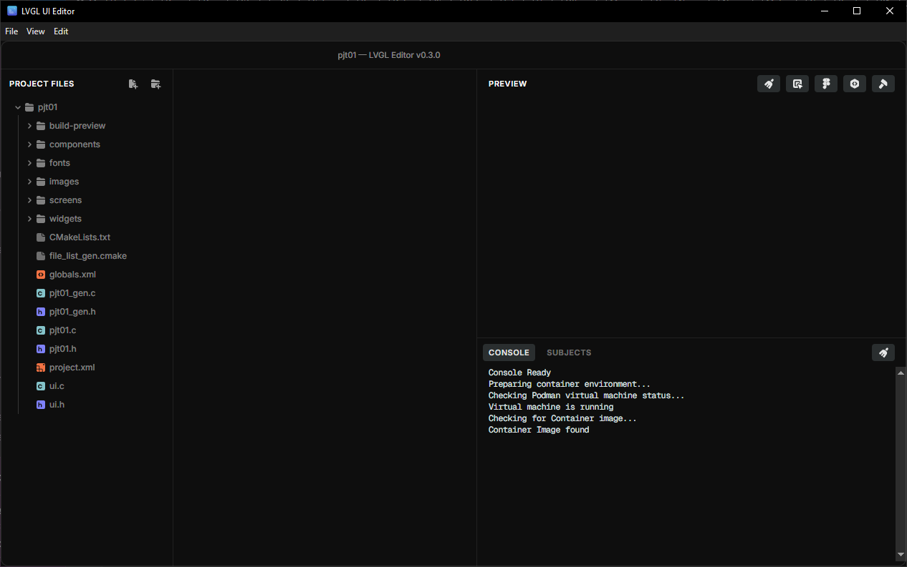

.. include:: custom_tools.txt

.. _overview:

========
Overview
========

    ..

    |lvglpro| User Interface

.. _reasons to use lvgl pro:

Reasons to Use |lvglpro|
************************

Shorter Development
-------------------

|lvglpro| accelerates UI development by

- giving you an instant view of your additions and changes,
- converting Figma_ designs to LVGL,
- making it easy to share your UI screens online,
- helping you to write UI tests, and
- integrating your UI via command-line interface.

Different Skill Sets
--------------------

|lvglpro| allows UI designers to efficiently contribute finished UI components
to firmware projects without having to be C programmers.

Live Collaboration
------------------

With |lvglpro|, the turn-around time between UI changes and seeing the actual results
can be reduced to mere seconds, making it practical for UI design, development and
business teams to collaborate on UI content in real time.

Based Around XML
----------------

|lvglpro| defines your UI components and screens using XML.  Enjoy autocompletion
for fast editing, seamless version control, and easy integration with external
tools, including AI assistants.

Runtime XML Loading
-------------------

Export your UI to C code, or load the XML files directly at runtime, requiring no
re-flashing.  Assets (images, fonts, etc.) and XML UI component definitions can
be read from an SD card, Wi-Fi, serial port, or any other input source.

Interactive Preview
-------------------

See changes instantly as you type XML, drag, or resize Widgets.  Live preview of
the results gives a WYSIWYG experience, similar to browser inspector tools.

Figma Integration
-----------------

Use the LVGL Figma_ plug-in to import style properties and images as XML code.  It
also supports automatic downloading of linked styles and images.

Share Your UI Online
--------------------

Push your XML and C code to Continuous Integration (CI), which turns them into a
live webpage that designers, managers and/or clients can directly interact with.
No setup is required.

Built-In Testing
----------------

Tests of the resulting UI can be built in:  simulate clicks, waits, and screenshot
comparisons against to instantly prove the UI is working as expected, or quickly
highlighting anything that needs attention.  Using testing this way is a great
way to build up an automated and thorough regression-testing pipeline, supporting
high confidence with every firmware release, small or large.

CLI Integration
---------------

All parts of the development sequence, including code-generation, Figma_ sync, XML
validation, and test execution, is available in a CLI tool, ready to integrate
into your workflow.

Favorite Platform
-----------------

|lvglpro| comes in Linux, Windows, and macOS flavors so your team will have
few, if any, technical barriers to begin using it.

Ways to Run It
--------------

- Stand-Alone Application
- VSCode Extension
- On-line (via web browser)

User Interface
**************

Menu
----

|lvglpro| has the usual File / View / Edit / etc. application menu.

.. _project files pane:

Project Files Pane
------------------

The left panel is a typical "project-tree" navigation panel.  It allows you to
efficiently and conveniently:

- observe the structure of your project files,
- create, delete and rename project files,
- find and open files into the editor area.

The subdirectories shown in the project are for the respective type of UI components
(i.e. Screens, Widgets, Components, Fonts and Images).

.. _editor pane:

Editor Pane
-----------

The Editor Pane appears in the middle of the window.  This is where you make the

|lvglpro| do valuable work for you, building your UI or Component
Library.  It is here that you can observe and edit the contents of any file in your
project, but its specialty is editing XML content that defines UI components
(:doc:`Widgets <widgets>`, :doc:`Components <components>` and :doc:`Screens <screens>`).
While editing XML, |lvglpro| has an extensive ":term:`IntelliSense`-like"
User Interface, which makes defining and editing UI components a breeze.  Similar to
context-sensitive assistance available in other "smart editors", the Editor Pane
assists you with almost every keystroke, considerably shortening the learning curve
required to produce finished, professional-quality UIs with |lvglpro|.

.. _right panel:

Right Panel
-----------

.. _preview pane:

Preview Pane
~~~~~~~~~~~~

When the Editor Pane is editing an XML file defining a Component or Widget, the
Preview Pane shows a live preview of your XML UI definition, pushed through *real
LVGL rendering* so you can instantly see the results of your work, that will match
the final result produced by firmware, pixel-for-pixel.

.. _console/subjects pane:

Output Pane
~~~~~~~~~~~

The Output Pane consists of a number of tabs where you can see various types of
current lists and results.

The Console Tab contains "log output" of the internal actions taken and their results.

The Subjects Tab contains list of the Observer-Pattern Subjects implemented in your
XML source files.  Each Subject represents a single "datum" in the application, that
UI elements (Widgets and Components) can "observe" and reflect visually.  See
:doc:`binding_to_data` for more details.

Coming Soon:  Tests, Translations, Animations

