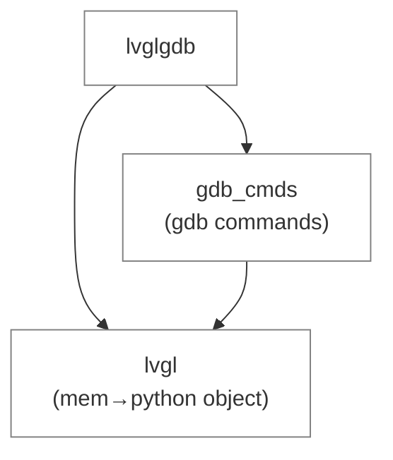

# lvglgdb

lvglgdb is a GDB script for LVGL.

# Installation

```bash
pip install lvglgdb
```

# Simple Usage

In your GDB session, run:
```bash
py import lvglgdb

dump obj
dump cache image
dump cache image_header
```

# Structure


