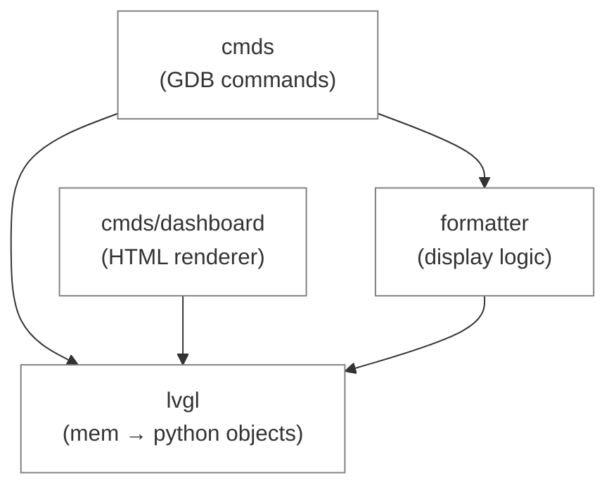

# lvglgdb

GDB Python extension for inspecting and debugging LVGL internals. 
Works with live debugging sessions, core dumps, and other 
GDB-compatible targets.

## Installation

```bash
pip install lvglgdb
```

## Usage

In your GDB session:

```bash
py import lvglgdb
```

### Dump Commands

```bash
dump obj                        # Dump widget tree
dump display -f png             # Dump display framebuffer as PNG
dump cache image                # Dump image cache entries
dump cache image_header         # Dump image header cache entries
check cache image               # Validate image cache integrity
dump anim                       # Dump active animations
dump timer                      # Dump registered timers
dump indev                      # Dump input devices
dump group                      # Dump focus groups
dump image_decoder              # Dump registered image decoders
dump fs_drv                     # Dump filesystem drivers
dump draw_task <layer_expr>     # Dump draw tasks for a layer
dump dashboard                  # Generate interactive HTML dashboard
dump dashboard -o out.html      # Save dashboard to file
```

### Info Commands

```bash
info style my_style             # Inspect a single lv_style_t
info style --obj my_obj         # Inspect all styles of an lv_obj_t
info draw_unit                  # Show draw unit information
info obj_class obj->class_p     # Show object class hierarchy
info subject &my_subject        # Show subject and its observers
```

### Dashboard

`dump dashboard` generates a self-contained HTML file with an interactive 3D
layer view, widget tree, style inspector, cache stats, animation list, and
draw buffer previews (RGB565 / RGB888 / ARGB8888 / XRGB8888).

## Structure


```mermaid
graph TD
    lvgl["lvgl<br/>(mem → python objects)"]
    cmds["cmds<br/>(GDB commands)"]
    formatter["formatter<br/>(display logic)"]
    dashboard["cmds/dashboard<br/>(HTML renderer)"]

    cmds --> formatter
    cmds --> lvgl
    dashboard --> lvgl
    formatter --> lvgl

    classDef pkg fill:white,stroke:gray
    class lvgl,cmds,formatter,dashboard pkg
```
