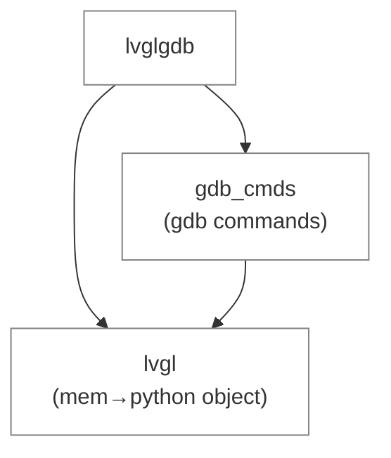

# lvglgdb

lvglgdb is a GDB script for LVGL.

# Installation

```bash
pip install lvglgdb
```

# Simple Usage

In your GDB session, run:
```bash
py import lvglgdb

dump obj
dump cache image
dump cache image_header
dump draw_task <layer_expr>

# Inspect a single lv_style_t variable
info style my_style

# Inspect all styles of an lv_obj_t
info style --obj my_obj
```

# Structure


```mermaid
graph TD
    lvgl["lvgl<br/>(mem→python object)"]
    gdb_cmds["gdb_cmds<br/>(gdb commands)"]
    lvglgdb["lvglgdb"]

    lvglgdb --> lvgl
    lvglgdb --> gdb_cmds
    gdb_cmds --> lvgl

    classDef pkg fill:white,stroke:gray
    classDef core fill:white,stroke:gray
    class lvglgdb,lvgl,gdb_cmds pkg
```
