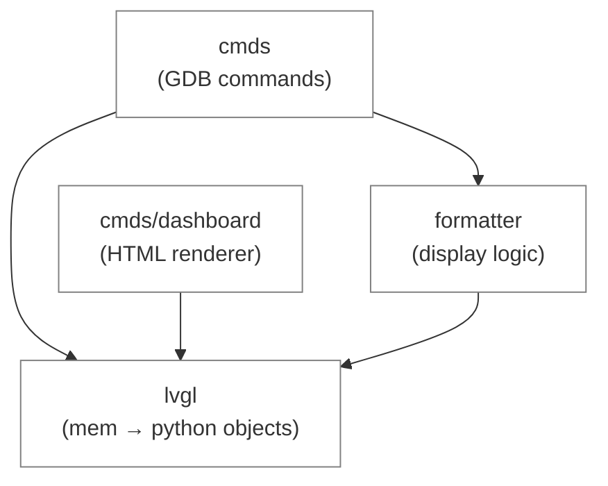

# lvglgdb

GDB Python extension for inspecting and debugging LVGL internals.
Works with live debugging sessions, core dumps, and other
GDB-compatible targets.

## Installation

```bash
pip install lvglgdb
```

## Usage

In your GDB session:

```bash
py import lvglgdb
```

### Dump Commands

Where a command takes a widget, style, class or layer, any C expression GDB can
evaluate will do: a variable, a member chain, or a plain address.

```bash
dump obj                        # Dump widget tree (same listing as `info widget`)
dump display -f png             # Dump display framebuffer as PNG
dump cache image                # Dump image cache entries
dump cache image_header         # Dump image header cache entries
check cache image               # Validate image cache integrity
dump anim                       # Dump active animations
dump timer                      # Dump registered timers
dump indev                      # Dump input devices
dump group                      # Dump focus groups
dump image_decoder              # Dump registered image decoders
dump fs_drv                     # Dump filesystem drivers
dump draw_task lv_global->disp_default->layer_head   # Draw tasks of a layer
dump dashboard                  # Generate interactive HTML dashboard
dump dashboard -o out.html      # Save dashboard to file
dump widget props lv_keyboard   # Which fields a widget class has
```

### Info Commands

```bash
info lvgl_version               # LVGL version of the target, and this plugin's version
info widget                     # List every widget, indented by tree depth
info widget my_obj              # All fields of one widget, incl. its own struct
info widget 0x50e000000820      # ...an address works as well as a variable
info widget my_obj text         # Only the named field(s)
info widget ball_1              # Find it by name, anywhere on any screen
info widget label3 -p screen_1/button_2   # ...or by name below a parent path
info widget screen_1/button_2/label3      # ...or by a full name path
info style my_style             # Inspect a single lv_style_t
info style --obj my_obj         # Inspect all styles of an lv_obj_t
                                # sizes as 100%/content, enums and fonts by name
info draw_unit                  # Show draw unit information
info obj_class &lv_button_class # Show object class hierarchy
info subject &my_subject        # Show subject and its observers
```

### Dashboard

`dump dashboard` generates a self-contained HTML file with an interactive 3D
layer view, widget tree, style inspector, cache stats, animation list, and
draw buffer previews (RGB565 / RGB888 / ARGB8888 / XRGB8888).

## Regenerating the constant tables

The style, flag, state, event and widget tables are generated from the LVGL
headers, not written by hand. After changing an enum or adding a widget field,
regenerate them from this directory:

```bash
python3 scripts/generate_all.py
```

The headers are taken from the nearest LVGL checkout above this one. Set
`LVGL_ROOT` to read a different one — either a checkout or an installed tree
that only has the public headers under `include/lvgl/`:

```bash
LVGL_ROOT=~/lvgl python3 scripts/generate_all.py
```

A generator that cannot find LVGL stops with an error rather than writing an
empty table over a good one. Regenerating rewrites every table, so check the
full diff: a parsing change that looks harmless for one table can quietly empty
another.

## Tests

```bash
python3 -m unittest discover tests
```

The decoders and the generator helpers are pure Python, so these run without a
target and without GDB.

## Structure


```mermaid
graph TD
    lvgl["lvgl<br/>(mem → python objects)"]
    cmds["cmds<br/>(GDB commands)"]
    formatter["formatter<br/>(display logic)"]
    dashboard["cmds/dashboard<br/>(HTML renderer)"]

    cmds --> formatter
    cmds --> lvgl
    dashboard --> lvgl
    formatter --> lvgl

    classDef pkg fill:white,stroke:gray
    class lvgl,cmds,formatter,dashboard pkg
```
