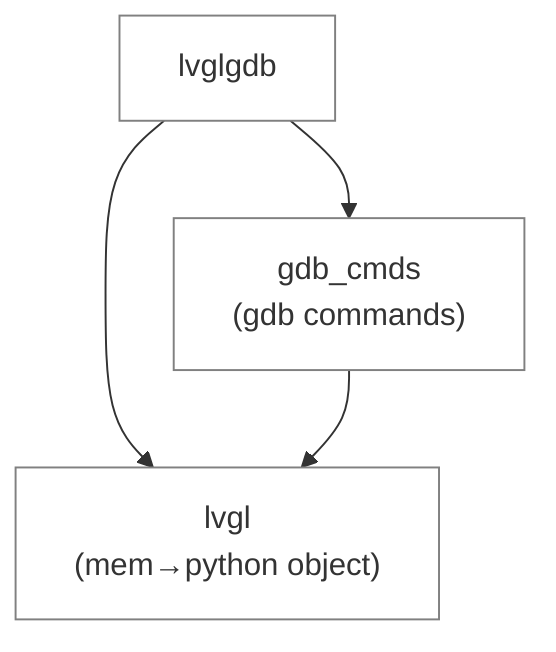

# lvglgdb

lvglgdb is a GDB script for LVGL.

# Structure

```mermaid
graph TD
    lvgl["lvgl<br/>(mem→python object)"]
    gdb_cmds["gdb_cmds<br/>(gdb commands)"]
    lvglgdb["lvglgdb"]

    lvglgdb --> lvgl
    lvglgdb --> gdb_cmds
    gdb_cmds --> lvgl

    classDef pkg fill:white,stroke:gray
    classDef core fill:white,stroke:gray
    class lvglgdb,lvgl,gdb_cmds pkg
```
