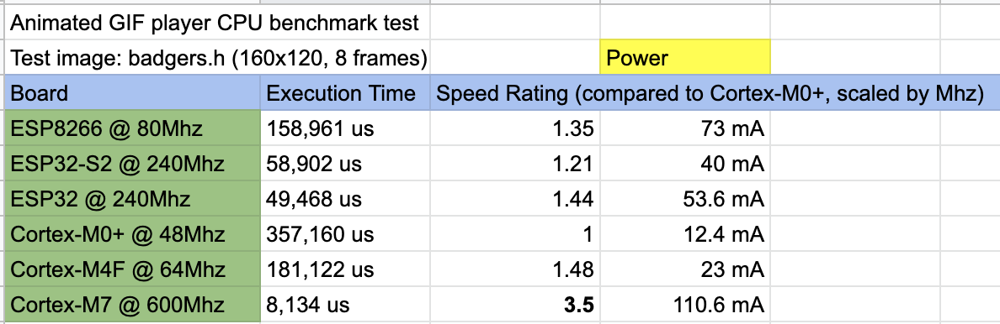

AnimatedGIF
===========

Copyright (c) 2020-2024 BitBank Software, Inc.<br>
Written by Larry Bank<br>
larry@bitbanksoftware.com<br>

**I optimize other people's code for a living. This library is a good example of the kind of work I do for my commercial clients; it contains many unique and clever optimizations that allows it to perform better than anything else available. I'm happy to contribute optimized libraries to the open source community in addition to working on commercial projects. Whatever platform you're using, I can make significant improvements to your native code. Please contact me so that I can show you how.**


I started working with image and video files around 1989 and soon turned my interest into a Document Imaging product based on my own imaging library. Over the years I added support for more and more formats until I had supported all of the standard ones, including DICOM. I sold my Document Imaging business in 1997, but still found uses for my imaging code in other projects such as retro gaming. I recently went looking to see if there was a good GIF player for Arduino and only found Adafruit's library. Unfortunately it only runs on their ATSAMD51 boards. I thought it would be possible to use my old code to create a universal GIF player that could run on any MCU/SoC with at least 24K of RAM, so I started modifying my old GIF code for this purpose. The latest focus of this project is both raw code speed and features that allow it to run well on microcontrollers (e.g. to use as little RAM as possible, and include optimized support for SPI LCDs).

*** NEW ***
-----------
The latest version brings much more speed to all modes of operation as well as a new way to decode (Turbo mode) which trades more memory for more speed. I took another look at the decoder and found some creative ways of speeding it up. I also wrote a new decode mode (Turbo) which uses the output image as the dictionary. It needs another 32K of RAM and can accelerate the decoding by 2-30x depending on the target system and image. I also added support for 32-bpp output and the GIFDraw callback is now optional. There is also the option to request "COOKED" output which means that the library will handle merging new frames onto the canvas and your GIFDraw callback gets pixels ready to for display.

MCU Accomodations
-----------------

The original idea of this project was to bring efficient GIF decoding to MCUs with insufficient memory to hold the entire framebuffer. It grew to include design features meant to accelerate SPI LCD output. The premise is that for most images, each line can be decoded and sent to the display (hopefully using DMA) while the next line is being decoded. This allows the SPI transmit time to essentially vanish and greatly reduces the amount of memory required. Not all images behave well with this arrangement - certain disposal options will not render correctly and images with lots of alternating transparent/opaque pixels will slow down the SPI output due to the mode switching. The other goal was to not dynamically allocate and free memory; all buffers are managed outside of the library. This allows the code to compile as C99 with no external dependencies beyond the basic clib/string functions.<br><br>
<b>
```diff
- N.B. Using a minimum of RAM on an MCU (not holding on to the fully rendered canvas) presents
- limitations on speed and what files will display correctly. If you're using a SPI LCD and manage
- the palette translation yourself, your code will update the display slower when there are
- alternating areas of transparent and opaque pixels because the LCD must be sent windowing
- commands in between the runs of pixels. If you instead choose to let AnimatedGIF handle
- the palette translation (COOKED mode), you run into a problem with GIF files that have
- local color palettes. They will not display correctly unless you keep a copy of the
- entire canvas in the final output pixel type (e.g. Width * Height * 3-bytes per pixel).
```
</b>

It's Easy Until It's Not
------------------------
Please look through the example code and WiKi for info on how best to get things working for your specific setup. If you have lots of spare memory, the code can do a lot of the work for you, but if your system is more constrained it can take more effort to get all of the pieces working well together. The biggest challenge is usually the GIFDraw callback function. It sends you 1 line of output at a time, but also includes extra info to help with SPI displays. There are a variety of example sketches for Arduino and Linux to help show you how it all works.

Designed for Speed
------------------

Beyond the MCU accomodations, this code can be used on PC class devices and will perform far better than libgif. The performance optimizations I made help on both MCU class devices and x86/Arm/RISC-V Linex/PC devices. I've been working on this code long enough to have tried nearly every trick in my toolbox. The code is about as fast as it can be in C, without cutting corners for malformed images nor resorting to CPU-specific optimizations or assembly language.

<p align="center">
  
</p>

### A note about performance

The chart above shows the total time to decode an 8-frame sequence included in the test_images folder. The decoding speed of your particular image depends on the complexity (how much compressed data) and if/how transparent pixels are used. Small runs of transparent pixels will interfere with the performance of displaying the image on an SPI LCD. This particular image doesn't use transparency, so the time is purely for decoding the data.

Features:
---------

- Supports any MCU with at least 24K of RAM (Cortex-M0+ is the simplest I've tested).
- Optimized for speed; the main limitation will be how fast you can copy the pixels to the display. You can use SPI+DMA to help.
- GIF image data can come from memory (FLASH/RAM), SDCard or any media you provide.
- GIF files can be any length, (e.g. hundreds of megabytes)
- Simple C++ class and callback design allows you to easily add GIF support to any application.
- The C99 code doing the heavy lifting is completely portable and has no external dependencies.
- Does not use dynamic memory (malloc/free/new/delete), so it's easy to build it for a minimal bare metal system.
- Super fast on desktop PCs too (or anything with enough RAM)

Acquiring GIF files to play:
----------------------------

You'll notice that the images provided in the test_images folder have been turned into C code. Each byte is now in the form 0xAB so that it can be compiled into your program and stored in FLASH memory alongside your other code. You can use a command I wrote called `image_to_c` (https://github.com/bitbank2/image_to_c) to convert a binary file into this type of text. If you use another tool, make sure to add a `const` modifier in front of the GIF data array to ensure that it gets written to FLASH and not RAM by your build environment.

The Callback functions:
-----------------------

One of the reasons that this is apparently the first universal GIF library for Arduino is because the lack of available RAM and myriad display options would make it difficult to support all MCUs and displays properly. I decided that to solve this issue, I would isolate the GIF decoding from the display and file I/O with callback functions. This allows the core code to run on any system, but you need to help it a little. At a minimum, your code must provide a function to draw (or store) each scan line of image. If you're playing a GIF file from memory, this is the only function you need to provide. In the examples folder there are multiple sketches to show how this is done on various display libraries. For reading from SD cards, 4 other functions must be provided: `open`, `close`, `read`, `seek`. There is an example for implementing these in the examples folder as well.

### Note:

If you're using the ESP32 or ESP8266 and playing GIF images stored in RAM, you'll need to provide the 4 file callback functions or modify the existing ones because RAM and FLASH are in different address spaces (Harvard architecture). The code assumes the source of the GIF data is in FLASH and uses `memcpy_P()` instead of `memcpy()` to access it.

The API:
--------

Please consult the Wiki for detailed info about each method exposed by the AnimatedGIF class.

---

If you find this code useful, please consider sending a donation or becoming a Github sponsor.

[](https://www.paypal.com/cgi-bin/webscr?cmd=_s-xclick&hosted_button_id=SR4F44J2UR8S4)

